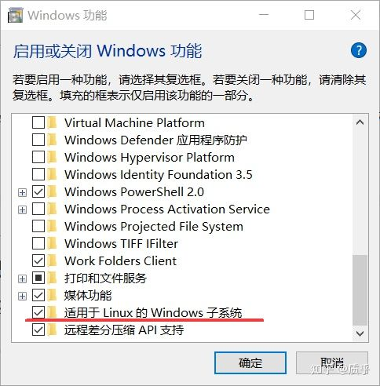

# 在Windows下安装WSL及相关R包

## WSL的安装

```
Windows Subsystem for Linux（简称WSL）是一个为在Windows 10上能够原生运行Linux二进制可执行文件（ELF格式）的兼容层。它是由微软与Canonical公司合作开发，目标是使纯正的Linux能下载和解压到用户的本地计算机，并且映像内的工具和实用工具能在此子系统上原生运行。 —— 百度百科
```

1. 在**控制面板-程序与功能**中启用 **适用于Linux的Windows子系统**



2. 在**Windows应用商店**搜索**ubuntu**，并安装，这里推荐**18.04**，可以方便的读取其它windows的文件
3. 安装完成后，从开始菜单或应用商店启动ubuntu，创建用户和密码

## conda环境的安装

conda是一个可以方便的管理各种python以及生信包的工具，避免大量手动操作

1. 从[conda官网](https://docs.conda.io/en/latest/miniconda.html)下载ubuntu安装包，并默认安装
2. 建立工作环境，可以参考这个[链接](https://pythonforundergradengineers.com/new-virtual-environment-with-conda.html)
3. 安装[bioconductor](https://www.bioconductor.org/)，如果顺利可以直接通过
```
conda install -c bioconda bioconductor-xcms
```
4. 在R中测试是否安装成功，在命令行中运行R，并运行library("xcms")

## XCMS的安装


## CIMAGE的安装

